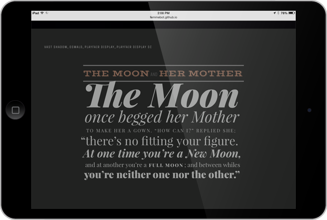
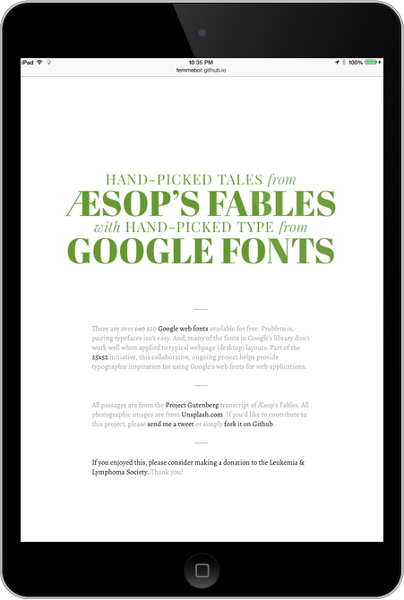

There are over 650 Google web fonts available for free. Problem is, pairing typefaces isn&rsquo;t easy. And, many of the fonts in Google&rsquo;s library don&rsquo;t work well when applied to typical webpage (desktop) layouts. Using passages from the Project Gutenberg transcript of Æsop&rsquo;s Fables, this collaborative, ongoing project helps provide typographic inspiration for using Google&rsquo;s free web fonts.

View [Google Web Fonts Typographic Project](http://femmebot.github.io/google-type/)

Fork it on Github: [https://github.com/femmebot/google-type](https://github.com/femmebot/google-type)

