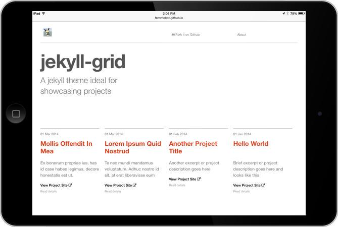

I needed a way to chronicle and showcase a growing list of projects for 25x52. Based on some quick research, Jekyll seemed like a good solution especially since my projects are hosted on Github. 

Except I didn&rsquo;t know Jekyll. 

And all the Jekyll templates I found were either ugly or ill-suited since they were mostly intended to be blog clones. 

So, out of necessity, I needed to make my own. And you&rsquo;re looking at it. 

Feel free to use it for your own project documentation. Fork it here: [https://github.com/femmebot/jekyll-grid](https://github.com/femmebot/jekyll-grid)

