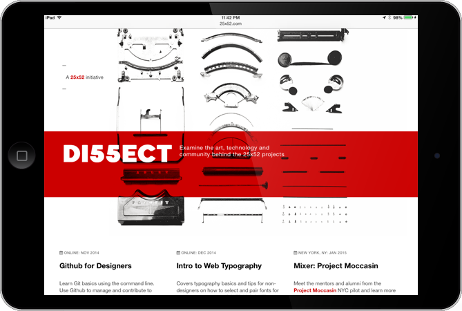

Di55ect offers a way to dig deeper into each project and extend the spirit of learning and community. 

Despite the fact that 25x52 projects are mostly designed to be short-lived MVP experiments, the conversations and interest surrounding them continued well past their projected “deadlines.” 

For instance, I would get questions about how to submit typography to the Google Web Fonts project or what’s the process for mentor-matching on Project Moccasin. I realized they weren’t asking questions that were already answered in plain sight. The questions probed into something much deeper.

Di55ect is an experiment that takes a close look at micro-topics from various 25x52 projects and builds an opportunity for learning and further conversation.

